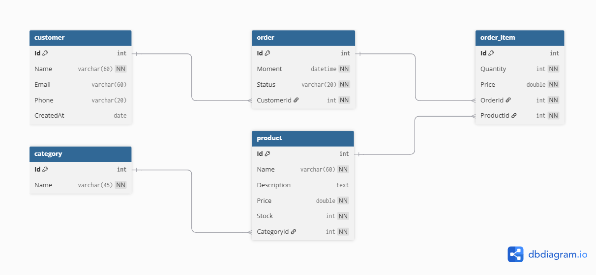

<div align="center">
  
</div>

# 📦 Sistema de Gerenciamento de Pedidos
### Order Management System

Este projeto é uma aplicação Java que utiliza o padrão **DAO (Data Access Object)** para gerenciar pedidos, clientes e produtos. Ele demonstra a integração de uma aplicação Java Desktop com um banco de dados relacional utilizando **JDBC (Java Database Connectivity)**.

---

## 🚀 Funcionalidades

O sistema permite realizar operações de **CRUD** (Create, Read, Update, Delete) e consultas avançadas nas seguintes entidades:

- **Pedidos (Orders):** Inserção, atualização de status, exclusão e busca por ID ou por cliente.
- **Itens de Pedido (Order Items):** Gerenciamento de itens vinculados a cada pedido, incluindo quantidade e preço.
- **Clientes (Customers):** Associação de pedidos a clientes específicos.
- **Produtos (Products):** Vínculo de produtos aos itens do pedido.

---

## 🛠️ Tecnologias Utilizadas

| Tecnologia | Descrição |
|---|---|
| **Java SE** | Linguagem principal do projeto |
| **JDBC** | Conexão e execução de comandos SQL |
| **MySQL** | Banco de dados relacional para persistência |
| **Padrão DAO** | Isolamento da lógica de acesso a dados |
| **Padrão Factory** | Utilizado na `DaoFactory` para instanciar as implementações JDBC |

---

## 📋 Pré-requisitos

Antes de começar, você precisará ter instalado em sua máquina:

- **Java JDK** (versão 11 ou superior recomendada)
- **MySQL Server**
- **Driver JDBC do MySQL** (`mysql-connector-java`)

---

## ⚙️ Configuração do Banco de Dados

1. Crie um banco de dados chamado `order_management`.

2. Configure as credenciais de acesso no arquivo `db.properties` localizado na raiz do projeto:

```properties
user=seu_usuario
password=sua_senha
dburl=jdbc:mysql://localhost:3306/order_management
useSSL=false
```

---

## 📂 Estrutura do Projeto

O projeto segue uma arquitetura em camadas para melhor organização e manutenção:

```
src/
├── application/          # Classes de teste (Entry points) com o método main
├── db/                   # Utilitários para conexão, fechamento de recursos e exceções SQL
├── model/
│   ├── dao/              # Interfaces que definem o contrato de acesso aos dados
│   │   └── impl/         # Implementações concretas das interfaces DAO utilizando JDBC
│   ├── entities/         # Classes de domínio (POJOs) que representam as tabelas do banco
│   └── enums/            # Enumerações como OrderStatus
db.properties             # Configurações de conexão com o banco de dados
```

### Status de Pedido (`OrderStatus`)

```
PENDING | PROCESSING | SHIPPED | DELIVERED | CANCELED
```

---

## 🧪 Como Executar os Testes

Para validar as funcionalidades de pedidos, execute a classe `ProgramOrderTests.java`. Ela realiza as seguintes operações:

1. Busca um pedido por ID e exibe os dados e itens associados.
2. Lista todos os pedidos de um cliente específico.
3. Retorna a lista completa de pedidos cadastrados.
4. Insere um novo pedido com status `CANCELED`.
5. Atualiza os dados de um pedido existente.
6. Atualiza apenas o status de um pedido específico.
7. Deleta um pedido via ID informado pelo usuário.

---

## ✒️ Autor

**Henrique Baz** — Desenvolvedor Principal